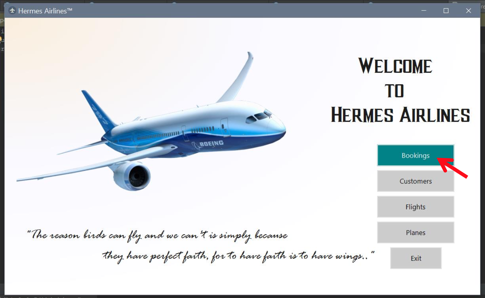
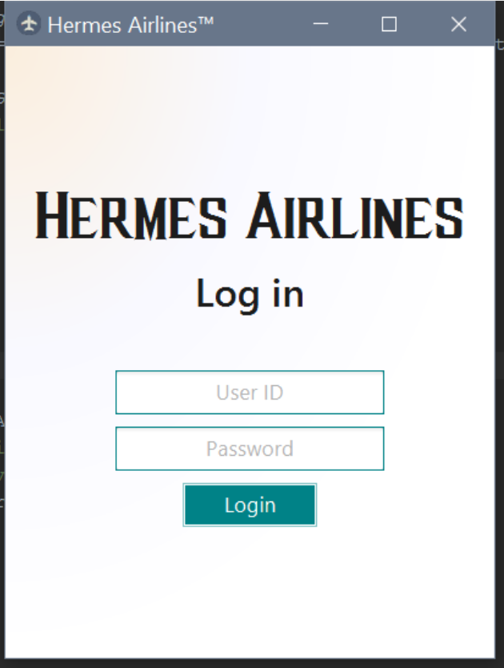
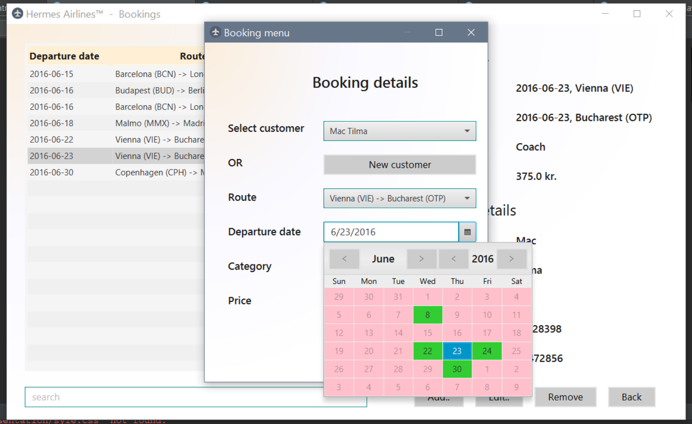
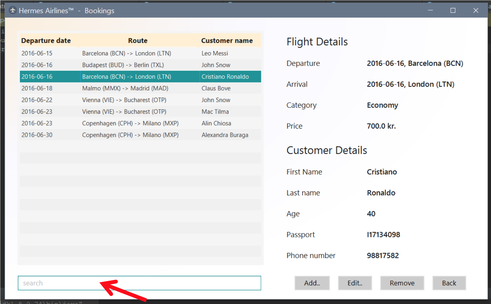

# Hermes-Airlines

> Simulation of an airline booking system built using **JavaFX**

# Features

* Authentication system guarding the app core

* View, add, remove functionality for planes, flights, customers and flight bookings

* Data stored in a MySQL database

* Friendly user interface with **JavaFX**

  

# Technologies

* [Java](https://go.java/) - widely used object-oriented language, the core of our system

* [JavaFX](http://docs.oracle.com/javafx/2/overview/jfxpub-overview.htm) - Java user interface library

* [MySQL](https://www.mysql.com/) - data storage solution

# Motivation

This is a school project marking the end of the first year studying Computer Science. It's purpose is to build a system that uses **Java** at the core, is connected to a **MySQL** database and has a nice user interface built in **JavaFX**. *"Hermes Airlines"* is a simulated company that me and the team used to create a problem-solver system for.

> A part of the assignment was to create a user manual, so you can check that out to get a sense of how to use the app

